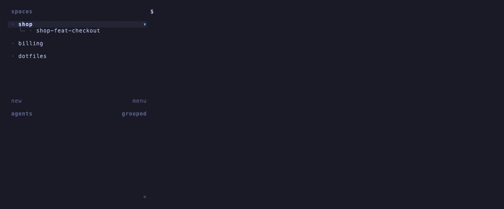

<div align="center">

# herdr-aspire-hud

**The health of the .NET Aspire AppHost in every worktree, on the herdr sidebar and one key away.**

[](LICENSE)
[](https://herdr.dev)
[](https://nodejs.org)
[](#requirements)
[](https://github.com/H3xept/herdr-aspire-hud/actions/workflows/check.yml)

</div>

A [herdr](https://herdr.dev) plugin for people who run one Aspire AppHost per
git worktree. A daemon paints a badge on every herdr space whose worktree holds a
running AppHost: `◆ healthy/total`, green, yellow or red. A popup lists every
running AppHost, expands the selected one to its resources, and stops AppHosts
you no longer need.

<div align="center">
  
</div>

The plugin is plain Node with no dependencies and no build step, so a clone is a
working install. It never passes `--force` to `aspire stop`, so a stop never
deletes persistent volumes.

## Features

- **Sidebar badge.** `◆ 6/8` on each space whose worktree holds a running
  AppHost. Green when every resource is fine, yellow while something starts or
  reports unhealthy, red when a resource failed or exited nonzero.
- **AppHosts popup.** Every running AppHost, including AppHosts in worktrees with
  no open space. The selected AppHost expands to its resources: type, state,
  health and endpoints. The popup opens on the AppHost of the space you called
  it from.
- **Stop from the popup.** Stop one AppHost, a marked set, or all of them, after
  a `y` confirmation. `aspire stop` goes first; signals follow only when it fails.
- **One shared cache.** The daemon and every open popup read one cache of aspire
  answers. Each answer is reused for 20 seconds, then fetched again
  automatically. `r` fetches everything at once.
- **Self-healing badges.** Every badge carries a TTL and is rewritten on every
  poll. A dead daemon's badges expire; a restarted herdr server gets its badges
  back on the next poll.

## Requirements

- herdr 0.8.0 or later, on Linux or macOS.
- Node 20 or later.
- The [Aspire CLI](https://aspire.dev/get-started/install-cli/)
  (`aspire`) on `PATH`, in `~/.aspire/bin`, or named by `ASPIRE_BIN`.

There are no npm dependencies.

## Install

```bash
herdr plugin install H3xept/herdr-aspire-hud
herdr plugin action invoke h3xept.aspire-hud.start   # startup hooks run only when the herdr server starts
```

Or link a checkout, to hack on it:

```bash
git clone https://github.com/H3xept/herdr-aspire-hud
herdr plugin link "$PWD/herdr-aspire-hud"
herdr plugin action invoke h3xept.aspire-hud.start
```

The `[[startup]]` hook starts the daemon with the herdr server from then on.

The plugin runs as your user, with your environment and the full herdr CLI.
`herdr plugin install` shows the manifest and every command it runs before it
installs; read them, and pin a revision with `--ref <tag-or-sha>` if you want
one. See herdr's
[trust and security guidance](https://herdr.dev/docs/plugins/#trust-and-security)
and [SECURITY.md](SECURITY.md).

### Sidebar rows

Herdr draws a plugin token only where a sidebar row names it. Add the three
tokens to a row in `[ui.sidebar.spaces]`:

```toml
rows = [
  ["state_icon", "workspace",
    { token = "$aspire_ok", fg = "#3fb950" },
    { token = "$aspire_warn", fg = "#d29922" },
    { token = "$aspire_down", fg = "#f85149", bold = true },
  ],
]
```

The daemon sets at most one of the three tokens per space. It uses one token per
level because herdr colors a token by its name.

<div align="center">
  
</div>

### Keybinding

Bind the popup to a key:

```toml
[[keys.command]]
key = "prefix+alt+a"
type = "plugin_action"
command = "h3xept.aspire-hud.open"
description = "Aspire AppHosts"
```

## Usage

Open the popup with your keybinding, or with
`herdr plugin action invoke h3xept.aspire-hud.open`.

The header shows the AppHost count by level and the age of the data, for example
`updated 9s ago · next in 11s`. The top list has one row per AppHost: level,
`healthy/total`, space name, AppHost path, pid and uptime. The lower half shows
the selected AppHost: its checkout, dashboard origin, SDK version, and one row per
resource, worst first.

### Popup keys

| Key | Action |
| --- | --- |
| `j` / `k`, `↓` / `↑` | Select the next or previous AppHost |
| `g` / `G` | Select the first or last AppHost |
| `J` / `K`, `PgDn` / `PgUp` | Scroll the resources, when they do not all fit |
| `enter` | Focus the AppHost's space and close |
| `o` | Open the AppHost's dashboard, logged in |
| `r` | Refresh now: skip the cache and repaint the badges |
| `space` | Mark or unmark the AppHost, then select the next one |
| `x` | Stop the marked AppHosts, or the selected one when none is marked |
| `X` | Stop every running AppHost |
| `y` | Confirm a stop; any other key cancels it |
| `q`, `esc`, `ctrl+c` | Close; waits while a stop is in flight |

`o` opens the dashboard with `open` on macOS and `xdg-open` on Linux.

### Plugin actions

| Action | What it does |
| --- | --- |
| `h3xept.aspire-hud.open` | Open the popup |
| `h3xept.aspire-hud.refresh` | Skip the cache, ask aspire now, repaint the badges |
| `h3xept.aspire-hud.stop-apphost` | Stop every AppHost in the invoking space, with no confirmation |
| `h3xept.aspire-hud.start` | Start the badge daemon |
| `h3xept.aspire-hud.stop` | Stop the badge daemon and clear its badges |

## How a resource is counted

| Level | Resource state |
| --- | --- |
| ok | `Running` and not unhealthy, or `Exited`/`Finished` with exit code 0 |
| warn | `Starting`, `Waiting`, `Stopping`, or unknown states; or `Running` but `Unhealthy`/`Degraded` |
| down | `FailedToStart`, `RuntimeUnhealthy`, or `Exited`/`Finished` with a nonzero or missing exit code |
| idle | `NotStarted` (explicit-start resources). Not counted. |

Parameters and connection strings are configuration, so they are not counted.
The badge color is the worst level of any AppHost in the space. An AppHost that
does not answer `aspire describe` makes the badge yellow; when no AppHost in the
space answers, the badge reads `◆ ?`.

An AppHost belongs to a space when its path is inside the space's worktree
checkout. When checkouts nest, the deepest checkout wins. Several spaces on one
checkout all show the AppHost.

## Stopping AppHosts

`x` and `X` ask for `y` before they stop anything.

1. The plugin runs `aspire stop --apphost <path>`. Aspire shuts the resources
   down and removes the session containers.
2. If `aspire stop` fails or hangs for 60 s, the plugin sends SIGTERM to the
   AppHost and to the `aspire` process that launched it. After 5 s it sends
   SIGKILL to any process that is still alive. The status line reports this as
   `killed`. Containers of a killed AppHost can outlive it.

The plugin never passes `--force`, because `--force` also deletes persistent
volumes such as database data.

A stop removes the stopped AppHosts from the cache at once and tells the daemon
to repaint. The popup does not close while a stop is in flight, because closing
it would kill a half-finished `aspire stop`.

The `stop-apphost` action stops every AppHost in the space it is invoked from,
with no confirmation. It has no default key. To bind it:

```toml
[[keys.command]]
key = "prefix+alt+k"
type = "plugin_action"
command = "h3xept.aspire-hud.stop-apphost"
description = "stop this space's AppHost"
```

## Daemon and CLI

Every action runs `bin/aspire-hud`. You can run the same verbs from a shell:

```bash
bin/aspire-hud daemon start | stop | run
bin/aspire-hud refresh               # skip the cache, ask aspire now, repaint badges
bin/aspire-hud stop-apphost [path…]  # stop AppHosts by file, or this space's
bin/aspire-hud status                # daemon state and its last poll, no aspire call
bin/aspire-hud clear                 # remove every aspire badge
bin/aspire-hud open-hud              # ask herdr to open the popup
bin/aspire-hud hud                   # the popup itself, in the current terminal
bin/aspire-hud version | help
```

| Verb | Effect |
| --- | --- |
| `daemon start` | Start the badge daemon in the background. Does nothing when it already runs. |
| `daemon stop` | Stop the daemon. It clears its badges at once. |
| `daemon run` | Run the daemon in the foreground. |
| `refresh` | Ask aspire about every AppHost now, then signal the daemon to repaint. |
| `stop-apphost [path…]` | Stop the named AppHost files. With no paths, stop every AppHost in the invoking space. |
| `status` | Print the daemon pid, the aspire binary, the configuration, the log path and the last poll. |
| `clear` | Clear this plugin's tokens on every space. A running daemon repaints on its next poll. |

How the daemon works:

- It polls once per cache TTL (20 s). A poll uses the cached `aspire ps` list
  and resource lists while they are younger than the TTL, so the daemon and an
  open popup never ask aspire twice for the same answer.
- It runs `aspire describe` only for AppHosts inside a space. The popup
  describes the other AppHosts too.
- `refresh`, the popup's `r`, and a stop send the daemon SIGUSR1. The daemon then
  repaints the badges at once instead of at the next poll.
- It rewrites every badge on each poll with a TTL of `max(30s, 3 × TTL)`.
- It logs level changes only, so a steady state writes nothing.

## Configuration

Put `KEY=value` lines in `$(herdr plugin config-dir h3xept.aspire-hud)/config.env`.
Lines that start with `#` are comments. Environment variables of the same name
override the file.

| Key | Default | Meaning |
| --- | --- | --- |
| `ASPIRE_HUD_CACHE_TTL` | `20s` | How long an aspire answer is reused; also the auto-refresh period. Takes `ms`, `s`, `m` or `h`; the minimum is 2 s. |
| `ASPIRE_BIN` | empty | Path to `aspire`. Empty means `PATH`, then `~/.aspire/bin/aspire`. |

Restart the daemon after you change the configuration:

```bash
herdr plugin action invoke h3xept.aspire-hud.stop
herdr plugin action invoke h3xept.aspire-hud.start
```

## How it works

```
aspire ps / describe ──► cache.json (TTL) ──► daemon ──► herdr socket ──► sidebar tokens
                              ▲
                              └──────────── popup (ticks every second)
```

The daemon and every popup read aspire through one shared cache. Whichever
reader finds an answer older than the TTL asks aspire and writes the answer
back. The daemon maps each AppHost onto the spaces whose worktree holds it and
writes one `$aspire_*` token per space over the herdr socket.

The plugin polls instead of following a stream. On Aspire 13.5, `aspire ps
--follow` emits one AppHost per line and never reports a removal, and `aspire
describe --follow` holds a process of about 64 MB per AppHost. A one-shot
describe costs about 0.3 s.

[docs/architecture.md](docs/architecture.md) has the module map, the data flow,
the poll lifecycle, the stop sequence and the design invariants.

## Where things live

| Path | What |
| --- | --- |
| `bin/aspire-hud` | CLI entry point for every hook, action and pane |
| `lib/aspire.mjs` | The Aspire CLI: list, describe, stop |
| `lib/collect.mjs` | One poll through the shared cache |
| `lib/model.mjs` | Pure rules: levels, counts, space mapping, tokens |
| `lib/daemon.mjs` | The badge daemon |
| `lib/hud.mjs` | The popup |
| `lib/socket.mjs` | The herdr socket client |
| `lib/state.mjs` | Pid file, log, last poll, cache |
| `lib/env.mjs` | Directories, configuration, the aspire binary |
| `herdr-plugin.toml` | The plugin manifest: startup hook, popup pane, actions |
| `tests/` | The test suite, fully offline |
| `docs/architecture.md` | How the parts fit together |
| `docs/demo/` | Fake aspire and herdr, and the VHS sources for the GIFs |

State lives in the plugin state directory that herdr passes in
(`~/.local/state/herdr/plugins/h3xept.aspire-hud` when run from a plain shell):

| File | What |
| --- | --- |
| `cache.json` | The aspire cache, shared by every herdr session |
| `sessions/<session>/daemon.pid` | The daemon's pid; the lock that allows one daemon per session |
| `sessions/<session>/daemon.log` | The daemon log, rotated to `daemon.log.1` past 256 KB |
| `sessions/<session>/last.json` | What the last poll saw, for `status` |

`<session>` is `default` for the default herdr socket, else the name of the
directory that holds the session's socket.

## Development

There is no build step and no dependency install. Node 20 runs everything.

```bash
git clone https://github.com/H3xept/herdr-aspire-hud
cd herdr-aspire-hud
npm test
```

The tests need neither `aspire` nor `herdr`. They run a fake `aspire` script and
a fake herdr socket in temp directories.

`docs/demo/` holds a fake `aspire` CLI that serves fixture AppHosts and a fake
herdr socket. With them you can run the popup with no Aspire and no herdr:

```bash
source docs/demo/env.sh
bin/aspire-hud hud
```

`env.sh` points `ASPIRE_BIN`, `HERDR_SOCKET_PATH` and the plugin directories
under `/tmp/aspire-hud-demo`, so it never touches your real herdr state.

To record the GIFs again (needs [VHS](https://github.com/charmbracelet/vhs),
`gifsicle`, and for `docs/badges.gif` herdr itself, which runs as a throwaway
server under `/tmp/aspire-hud-herdr`):

```bash
bash docs/demo/record.sh
```

## Contributing

Read [CONTRIBUTING.md](CONTRIBUTING.md) before you open a pull request. Changes
are listed in [CHANGELOG.md](CHANGELOG.md).

## License

[MIT](LICENSE).
