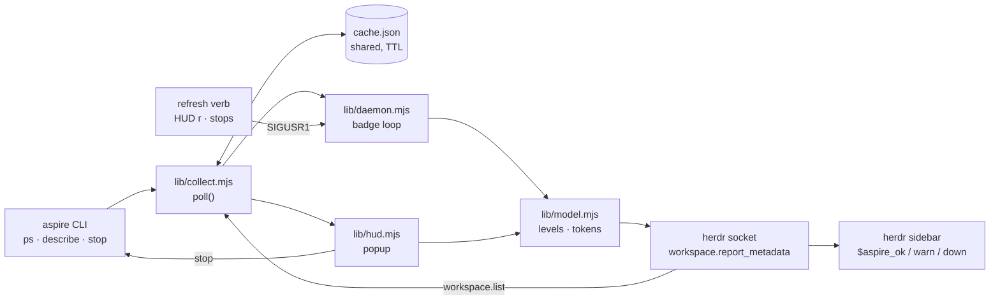

# Architecture

herdr-aspire-hud is plain Node ESM with no dependencies and no build step. One
CLI, `bin/aspire-hud`, is the entry point for every herdr hook, action, pane and
shell command. The code under `lib/` splits into I/O modules at the edges and one
pure module, `lib/model.mjs`, in the middle.

## Module map

| Module | Responsibility |
| --- | --- |
| `bin/aspire-hud` | The CLI and its verbs |
| `lib/env.mjs` | Directories, configuration, the socket path, the aspire binary |
| `lib/aspire.mjs` | The Aspire CLI as data: list, describe, stop |
| `lib/socket.mjs` | The raw herdr socket client |
| `lib/state.mjs` | Files on disk: the daemon pid, log, last poll, and the aspire cache |
| `lib/collect.mjs` | One poll through the shared cache |
| `lib/model.mjs` | Pure rules: levels, counts, space mapping, tokens |
| `lib/daemon.mjs` | The badge daemon loop |
| `lib/hud.mjs` | The popup TUI |

### `bin/aspire-hud`

Parses one verb and runs it: `hud`, `open-hud`, `stop-apphost`, `refresh`,
`daemon start|stop|run`, `status`, `clear`, `version` and `help`. The manifest
calls the same verbs, so a keybinding and a shell run the same code. `open-hud`
runs `herdr plugin pane open --plugin <id> --entrypoint hud`. `stop-apphost`
with no paths reads the invoking space from `HERDR_PLUGIN_CONTEXT_JSON` (or
`HERDR_WORKSPACE_ID`), maps running AppHosts onto spaces, and stops the ones in
that space. It shows a herdr notification with the result and exits 1 when a
stop fails. `refresh` runs a fresh poll, then sends the daemon SIGUSR1. When a
verb fails inside herdr, the CLI also shows the error as a notification.

### `lib/env.mjs`

Everything about the plugin's own installation. Herdr injects
`HERDR_PLUGIN_ID`, `HERDR_PLUGIN_CONFIG_DIR`, `HERDR_PLUGIN_STATE_DIR`,
`HERDR_SOCKET_PATH`, `HERDR_BIN_PATH` and `HERDR_PLUGIN_CONTEXT_JSON`. When they
are absent, as in a plain shell, the fallbacks name the same directories herdr
would: plugin id `h3xept.aspire-hud`, config in
`~/.config/herdr/plugins/config/<id>`, state in
`~/.local/state/herdr/plugins/<id>`, socket at `~/.config/herdr/herdr.sock`. So a
shell run and a keybinding agree about the daemon's pid file. `config()` reads
`config.env` (`KEY=value`, `#` comments, optional quotes) over the defaults, and
an environment variable of the same name wins over the file. `durationMs()`
parses `90`, `90s`, `45m`, `6h` and `500ms`. `aspireBin()` resolves the CLI:
`ASPIRE_BIN`, then `PATH`, then `~/.aspire/bin/aspire`. The last fallback exists
because herdr starts plugin commands from its server's environment, which is
often not a login shell.

### `lib/aspire.mjs`

Runs the Aspire CLI with `--nologo --non-interactive` and, for queries,
`--format Json`. It parses from the first `[` or `{`, because the CLI can print a
notice before the document. `listAppHosts()` runs `aspire ps` (15 s timeout).
`describe()` runs `aspire describe --apphost <path>` (10 s timeout) and keeps only
the fields the badge and the HUD read. It never throws: an AppHost that does not
answer comes back with an `error` field, because a hung AppHost is a state the
HUD must show. `stopAppHost()` and `stopAppHosts()` implement the stop sequence
below; the batch form runs four stops at a time and reports each result as it
finishes.

### `lib/socket.mjs`

A minimal client for the herdr socket. The server answers one newline-delimited
JSON request per connection and then closes it, so `send()` fans requests out
over separate connections, 32 at a time, with a 5 s timeout each. A transport
failure becomes an error envelope in the result array; the caller decides what
is fatal. `call()` sends one request and throws on an error response.
`listSpaces()` wraps `workspace.list`. The daemon uses the socket instead of the
`herdr` binary so that a poll does not spawn one process per token write.

### `lib/state.mjs`

Owns every file the plugin writes. Herdr gives a plugin one state directory per
user, but badges belong to one herdr session, so the daemon files live under
`sessions/<key>/`. The key is the name of the directory that holds the socket,
or `default` for `~/.config/herdr/herdr.sock`. Per session: `daemon.pid` (the
lock; a pid whose process is dead counts as no daemon), `daemon.log` (rotated to
`daemon.log.1` past 256 KB), and `last.json` (what the last poll saw, for
`status`). The aspire cache, `cache.json`, sits at the top of the state
directory and is shared by every session, because AppHosts are machine-wide.
Every write is atomic: write a temp file, then rename.

### `lib/collect.mjs`

`poll()` produces one snapshot: running AppHosts, herdr spaces, and a describe
result per AppHost. It reads the cache and reuses the `aspire ps` answer while
it is younger than the TTL. It describes an AppHost again when it has no cached
detail, when its pid changed (the AppHost restarted), or when the detail is
older than the TTL. Describes run four at a time. Spaces always come live from
the socket: one cheap call, and they change often. `fresh: true` ignores the
cache; `mappedOnly: true` skips describes for AppHosts outside every space. The
snapshot's `at` is the time of the oldest answer it shows. `forgetAppHosts()`
removes stopped AppHosts from the cache, so no reader shows them for another
TTL. `cacheTtlMs()` reads `ASPIRE_HUD_CACHE_TTL`, falls back to 20 s on bad
input, and never goes below 2 s.

### `lib/model.mjs`

The rules, with no I/O, so tests run them against recorded `aspire describe`
output. `classify()` turns a resource state into `ok`, `warn`, `down` or `idle`.
`summarize()` counts process resources by level and leaves out parameters,
connection strings and idle resources. `levelOf()` gives an AppHost's level, or
`unknown` when its describe failed. `tokensFor()` builds the full token set for
one space: exactly one of `aspire_ok`, `aspire_warn`, `aspire_down` carries the
badge text, and the others are `null`, so a level change clears the previous
color. `mapToSpaces()` assigns each AppHost to the spaces whose worktree
checkout contains its path, on a path boundary; the deepest checkout wins, and
several spaces on one checkout all get the AppHost. The module also holds the
display helpers the HUD uses: durations, start time, resource sort order, and
the dashboard origin without its login token.

### `lib/daemon.mjs`

The badge loop. `run()` claims the pid file, then polls with
`mappedOnly: true` once per TTL. For each space that holds an AppHost it sends a
`workspace.report_metadata` request with the space's tokens, source set to the
plugin id, and a token TTL. Spaces that had a badge last poll and have no
AppHost now get cleared tokens. The loop logs level transitions only, so a
steady state writes nothing. `start()` spawns `daemon run` detached unless the
pid file names a live process. `stop()` sends SIGTERM and waits up to 5 s for
the pid file to go. `nudge()` sends SIGUSR1. `clearAll()` clears this plugin's
tokens on every space. Herdr scopes tokens by source, so the plugin can never
clear another plugin's tokens.

### `lib/hud.mjs`

The popup. It draws with raw ANSI escapes and reads raw keys from stdin. Every
second it calls `poll()` without `mappedOnly`, so it describes every running
AppHost, including AppHosts in worktrees with no open space. Because the poll
goes through the cache, a tick asks aspire only when the cache has expired, and
a popup opens at once when the daemon polled recently. AppHosts sort by the
sidebar position of their space; AppHosts with no space sort last, labelled by
the nearest ancestor directory that holds `.git`. The popup opens on the
AppHost of the space it was invoked from, then on the focused space's AppHost,
then on the first row. It stops AppHosts through `stopAppHosts()`, then calls
`forgetAppHosts()` and `nudge()`.

## Data flow

The daemon and every open HUD read the same `cache.json`. Whichever reader finds
an answer older than the TTL asks aspire and writes the new answer back. So the
daemon and any number of popups together ask aspire at most once per TTL for the
same answer.

## Poll lifecycle

1. The `[[startup]]` hook runs `daemon start` when the herdr server starts. The
   daemon logs `up` with its period and token TTL.
2. Each tick runs `poll({ mappedOnly: true })`. Fresh cache entries are reused;
   stale ones are fetched again and written back.
3. The daemon writes tokens with a TTL of `max(30s, 3 × cache TTL)` and rewrites
   every badge on every tick. A killed daemon's badges expire by themselves. A
   restarted herdr server, which holds no plugin tokens, gets its badges back on
   the next tick with no reconnect logic.
4. The next tick is scheduled one cache TTL after the current tick ends.
5. SIGUSR1 (from `refresh`, the HUD's `r`, or a stop) runs a tick at once. When a
   tick is already running, the daemon runs another one as soon as it ends,
   instead of waiting a full period.
6. SIGTERM or SIGINT (`daemon stop`) waits for the running tick, clears every
   badge the daemon painted, logs `stopped` and releases the pid file. A tick
   that ends after the stop began does not repaint.

`refresh` itself runs `poll({ fresh: true })`, which refills the cache for every
AppHost. The nudged daemon then repaints from that cache without asking aspire
again.

## Stop sequence

`stopAppHost()` in `lib/aspire.mjs`:

1. Run `aspire stop --apphost <path>` with a 60 s timeout. Aspire shuts the
   resources down in order and removes the session containers. Success returns
   `stopped`.
2. If that fails or times out, check the AppHost pid and the pid of the `aspire`
   process that launched it (`cliPid` from `aspire ps`). If both are already
   gone, the stop worked: return `stopped`.
3. Otherwise send SIGTERM to each live pid and wait up to 5 s, checking every
   100 ms.
4. Send SIGKILL to any pid that is still alive. If all are gone, return `killed`;
   if one survives, return `failed` with the error from step 1.

The plugin never passes `--force`, because `--force` also deletes persistent
volumes such as database data. Containers of a killed AppHost can outlive it.

After a batch, the caller removes every AppHost that did not fail from the cache
and nudges the daemon. The HUD refuses to close while a stop is in flight,
because closing the popup kills its children, and with them an `aspire stop`
that is halfway through.

## Why polling

The Aspire CLI has streaming modes, but neither fits:

- On Aspire 13.5, `aspire ps --follow` emits one AppHost object per line and
  never reports a removal, so it cannot say when an AppHost goes away.
- `aspire describe --follow` holds a process of about 64 MB per AppHost for as
  long as it runs.

A one-shot `aspire describe` costs about 0.3 s. One-shot calls on a timer are
cheaper and always return the whole state.

## Design invariants

- **One source of aspire answers.** Every reader goes through `poll()` and the
  shared cache. No module calls `aspire ps` or `aspire describe` around it.
- **Badges are leases.** Every token write carries a TTL and is repeated each
  tick. No state survives a dead daemon or a restarted server.
- **One token per level.** Herdr colors a token by its name, so the plugin owns
  three tokens and sets exactly one per space. The other two are `null`.
- **Rules are pure.** `lib/model.mjs` does no I/O. Classification, counting,
  space mapping and token choice are tested without aspire or herdr.
- **Stops never destroy data.** No code path passes `--force` to `aspire stop`.
- **One daemon per herdr session.** The pid file is the lock, and it is
  namespaced by session so two herdr sessions do not fight over badges.
- **No dependencies, no build.** A clone is a working install.
